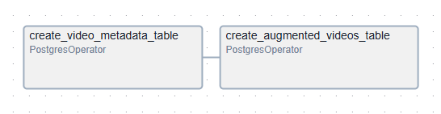
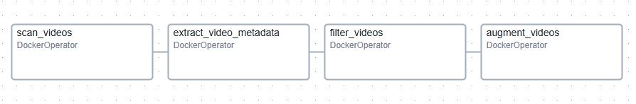

# media-flow

A simple video processing pipeline using Airflow, Ray, FFmpeg, and PostgreSQL. It ingests raw videos, extracts metadata, filters quality videos, and produces augmented variants, recording outputs to a database.

## User Guide

- Prerequisites
  - Docker and Docker Compose
  - Ubuntu 22.04 host or compatible
  - Ports 8080 (Airflow Web), 5555 (Flower optional)
  - Disk space 10GB+, RAM 4GB+, 2+ CPUs (see compose init checks)
  - FFmpeg installed inside worker image (handled by Dockerfile)

- Quick Start
  1. Build worker image (Pixi-based):
     - From /app: `docker build -t media-flow:1.0 .`
  2. Start Airflow stack:
     - From /app: `docker compose up -d`
     - First boot runs migrations and creates default user (airflow/airflow).
     - Open Airflow UI: Use "$BROWSER" http://localhost:8080
  3. Mount repository for Airflow DAGs:
     - docker-compose.yaml maps /app/src to /opt/airflow/dags and repository path to /usr/local/airflow_repo.
  4. Ensure data directory exists and has raw videos:
     - /app/data/raw on the host (bind-mounted in worker container by the DAG)

- Run Database Setup DAG
  - In Airflow UI, unpause db_schema_setup_dag and trigger it.
  - It creates:
    - video_metadata (stores original files + extracted metadata)
    - augmented_videos (stores augmented outputs + parameters)

    

- Run Video Pipeline
  - Unpause video_db_pipeline in Airflow UI.
  - Trigger run; tasks:
    1. scan_videos: inserts new files from /app/data/raw
    2. extract_metadata: runs ffprobe via Ray workers
    3. filter_videos: marks is_quality_video based on width/duration
    4. augment_videos: produces augmented video outputs in /app/data/augmented and writes records

    

- CLI Script Usage (inside container)
  - scan.py:
    - `python src/media_flow/tasks/scan.py --input_dir /app/data/raw --max_videos 20`
  - extract_metadata.py:
    - `python src/media_flow/tasks/extract_metadata.py`
  - filter.py:
    - `python src/media_flow/tasks/filter.py --min_width 360 --max_duration 60`
  - augment.py:
    - `python src/media_flow/tasks/augment.py --output_dir /app/data/augmented`

- Environment Variables
  - DB_HOST, DB_NAME, DB_USER, DB_PASSWORD are required for all tasks.
  - The Airflow DAG passes these from the Airflow postgres_default connection.

- Troubleshooting
  - No videos found: Check /app/data/raw exists and contains files with extensions mp4/avi/mov/mkv.
  - DB connection errors: Verify postgres_default connection in Airflow and service health.
  - FFprobe failures: Ensure ffmpeg/ffprobe available in worker image (Dockerfile installs ffmpeg).
  - Ray memory pressure: augment.py limits object store; adjust batch_size or object_store_memory.
  - Permissions: Ensure mounted paths are accessible by containers (Windows paths in compose/DAG may need adjustment on Linux).

## Technical Documentation

- Architecture
  - Orchestration: Airflow (CeleryExecutor, Redis, Postgres)
  - Worker image: Built from Dockerfile with Pixi and Python deps
  - Tasks:
    - scan.py: file discovery and DB insertion
    - extract_metadata.py: ffprobe metadata via Ray
    - filter.py: DB-side filtering updates
    - augment.py: frame-wise augmentation via Ray and OpenCV
  - Data flow:
    - Files on disk -> video_metadata rows -> enriched metadata -> filtered flag -> augmented outputs -> augmented_videos rows

- DAGs
  - setup_db_schema.py
    - Creates tables and indexes.
    - Runs on demand; no schedule.
  - video_pipeline.py
    - Daily schedule; catchup disabled.
    - DockerOperator for each step; mounts repo and passes DB env vars.

- Database Schema
  - video_metadata
    - video_id BIGSERIAL PK
    - original_path UNIQUE, filename
    - duration_sec, frame_rate, width, height, codec_name, color_space
    - is_quality_video BOOLEAN DEFAULT FALSE
    - scan_date TIMESTAMP DEFAULT CURRENT_TIMESTAMP
    - Unique index on original_path
  - augmented_videos
    - augmentation_id BIGSERIAL PK
    - video_id FK -> video_metadata(video_id) ON DELETE CASCADE
    - augmented_path, augmentation_type, parameters_used JSONB, status, timestamp_processed
    - UNIQUE(video_id, augmented_path)

- Task Details
  - scan.py
    - Scans input_dir for video files.
    - Inserts (original_path absolute, filename) with ON CONFLICT DO NOTHING.
  - extract_metadata.py
    - Selects videos where duration_sec IS NULL.
    - Ray remote ffprobe returns duration, frame_rate, width, height, codec_name, color_space.
    - Bulk UPDATE sets scan_date = CURRENT_TIMESTAMP.
  - filter.py
    - Resets status_column to FALSE.
    - Marks rows TRUE where width >= min_width and duration_sec <= max_duration.
  - augment.py
    - Queries quality videos not already augmented with augmentation_type='standard_dropout'.
    - Uses Albumentations pipeline and OpenCV writer to produce 480x480 mp4 output.
    - Inserts a record into augmented_videos with parameters_used JSON and status READY.

- Configuration and Build
  - pixi.toml
    - Python 3.12; installs Ray, OpenCV, Albumentations, Airflow providers, psycopg2.
  - Dockerfile
    - Ubuntu 22.04 base; installs ffmpeg and Pixi; installs deps using pixi install.
  - docker-compose.yaml
    - Airflow services + Postgres + Redis.
    - Maps /app/src to /opt/airflow/dags; also maps local repo path to /usr/local/airflow_repo for DAG mount compatibility.
    - Exposes webserver 8080.

- Operational Notes
  - Paths and mounts:
    - DAG uses REPO_PATH_ON_HOST and REPO_PATH_IN_CONTAINER for DockerOperator bind mounts; ensure they match your host system path layout.
    - DATA_PATH in DAG is /app/data; create raw and augmented subfolders.
  - Resource limits:
    - Ray object store memory limited in augment.py; adjust if needed.
    - Batch size defaults to 60; lower if memory constrained.

- Extensibility
  - Add new augmentation types:
    - Extend augment.py parameters and selection logic; ensure augmented_videos uniqueness constraint considers type.
  - Additional filters:
    - Modify filter.py criteria and column name via status_column.
  - New metadata fields:
    - Extend ffprobe selection and DB schema; adjust UPDATE statement accordingly.

- Security
  - DB credentials passed via Airflow connection; avoid hardcoding secrets.
  - Do not commit .env or secret files; .gitignore already excludes common sensitive paths.